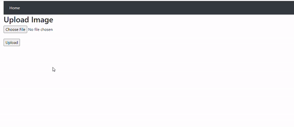
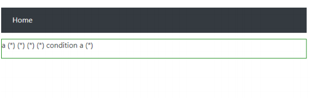
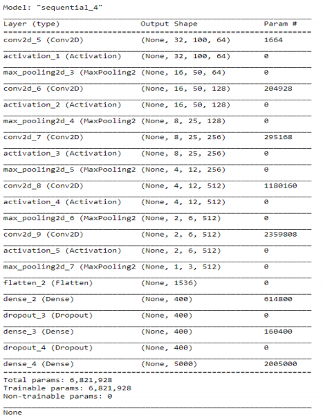

# OCR-CNN-Flask

The project consists of a model trained to extract words from natural scene images. When a user uploads the image, the detector(Tesseract/OpenCV) will preprocess and crop the detect words from the image and saves it for classification. The classifier(CNN) will then predict the word with highest confidence and return (*) if the word is not in the dictionary i.e.(confidence<50%). The model was trained on a dictionary of English words(VGG Synthetic Word Dataset) which compelled it to classify by words rather than by characters. This makes the model to rely on a dictionary for word recognition. The model was being deployed using flask.

## Unrecognize word

## Requirements
* OpenCV
* Tesserocr
* Tesseract
* Keras
* Numpy
* Pillow
* Tensorflow 
* Flask

## CNN Model

## Run
`python app.py`

## Refrence
[Project](https://github.com/AlChiu/HandWriting-OCR-CNN-WebApp)
